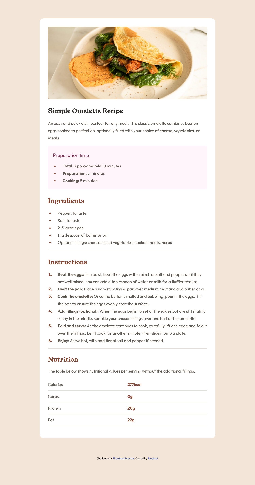
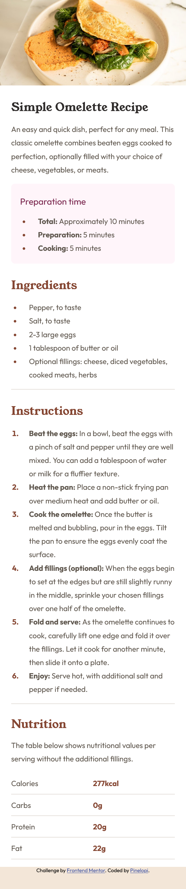

# Frontend Mentor - Recipe page solution

This is a solution to the [Recipe page challenge on Frontend Mentor](https://www.frontendmentor.io/challenges/recipe-page-KiTsR8QQKm).
## Table of contents

  - [Screenshot](#screenshot)
  - [Links](#links)
  - [Built with](#built-with)
  - [Author](#author)

## Screenshots

Desktop version:

Mobile version:

## Links

- Solution URL: https://www.frontendmentor.io/solutions/recipe-page---desktop-and-mobile-version-OOFlaTv7NU
- Live Site URL: [PinelopiRomeou](https://pinelopi-romeou.netlify.app/)

## Built with

- Semantic HTML5 markup
- CSS custom properties
- Flexbox

## Author

- GitHub - [Pinelopi-Romeou](https://github.com/Pinelopi-Romeou)
- Website - [PinelopiRomeou](https://pinelopi-romeou.netlify.app/)
- Frontend Mentor - [@Pinelopi-Romeou](https://www.frontendmentor.io/profile/Pinelopi-Romeou)
